# Lost Continent of Adria

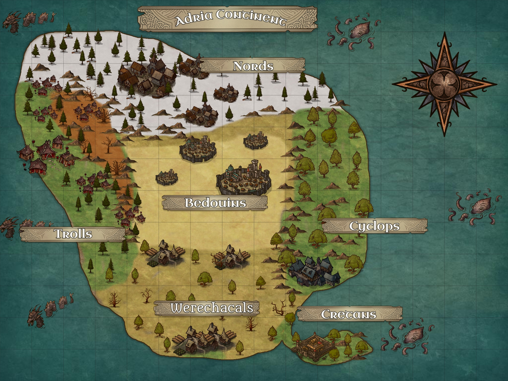

*In the mythical continent of Adria, a fantastic and magical land there is a permanent conflict between all the human and beast races that inhabit that land.*

*You will have the mission to lead the Nords, a human race that lives in the snowy mountains and pine forests of the north through a journey to conquer the world.*

*You will travel through deserts, forests, mountains, volcanos, and forests, full of secrets, animals, and mythical creatures.*

# About this Mod

I started developing this mod many years ago, playing around with the map editor and modifying the random maps scripts. 
Some (fewer) years ago I decided to create an actual Campaign with my maps, but I did not finish. This year I decided to put everything together and finish it once and for all :).

My idea behind the Campaign is to combine some new concepts:

* Create a new mechanic (more "realistic") where you can't create new unity between each quest. You will receive new units after each quest, but you cannot spawn new units on each of them. Every unity is precious, and you have to use them wisely.

* This is not a "mythological reality", but an RPG-like fantasy world, such as Dungeons and Dragons, and The Elder Scrolls. You will have a continent to explore, and many races, some humans, some not. But you are going to control armies, not a character. 

## How to Install

Just place all the files in the Age of Mythology installation folder. For steam installations, the path is usually "C:\Program Files (x86)\Steam\steamapps\common\Age of Mythology".

To uninstall, just execute the script "LostContinentOfAdria.uninstall.bat" (take care, cannot be undone).

## Campaign and Gameplay

* In the main campaign, will control the **Nords**. 

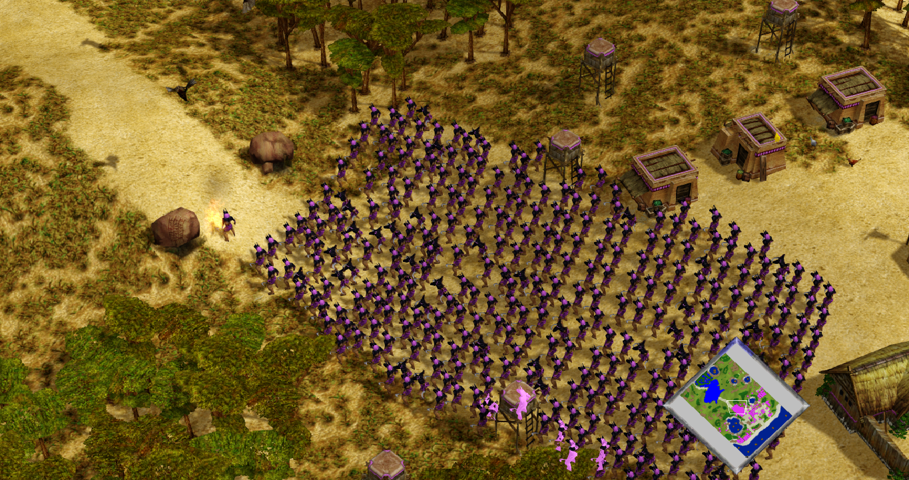

* On each quest of the main Campaign you will have to defeat one or two armies of a rival race.

* Once you conquer all the territory of a race, and force all their cities to surrender, this race will be included in your army, and you will be able to control its unity as well. 

* **Unlike** in the Vanilla game, in the Campaign quest, you **CANNOT** create unities. You and your enemy will start with evey unity they will have available from the start, except the one granted as gift of the gods when you advance an age. Therefore, you must use each unity wisely. Some hints:
    * Start the game using a **deffensive strategy**;
    * Protect your unitys building **walls** and **buildings**;
    * Use the **terrain** to gain advantage in battle. Forests, Montains and small spaces can be used as natural protecion points;
    * Create **ambushes** to win battles even **outnumbered**;
    * Protect your close-combat unitys using **long-range units**;
    * **Avoid close-combat** until it is strictly necessary.

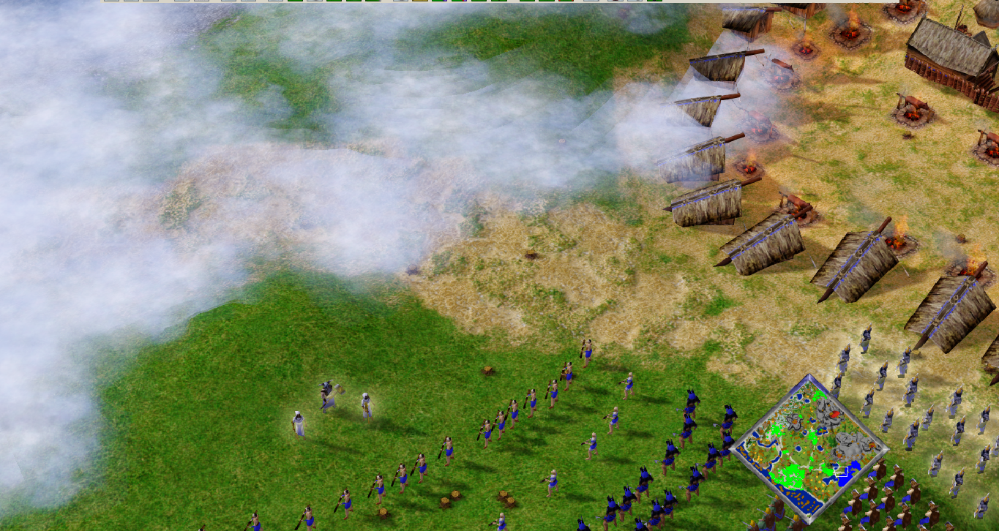

* You don't have to kill every single unity of your enemy to defeat its army. Instead, you will have to defeat the leader of each settlement. This unity should be close to its city setlement. The only exception for this rule is the Troll's race. You will have to defeat both the Shaman Troll and its "pet" of each settlement. The Shaman "pet" will be a powerfull mythical beast, such as a giant beatle or a dragon.

## Lore 
The Lost Continent of Adria has six major regions, each one of which is inhabited by one different race:

* **Nordic Taiga**: the northern region of the continent, the homeland of the Nords. If full of snowy mountains and pine forests. Their capital is hidden on a hill in the middle of the forest. The wildlife is composed mainly of deer, bears, and wolves.
> 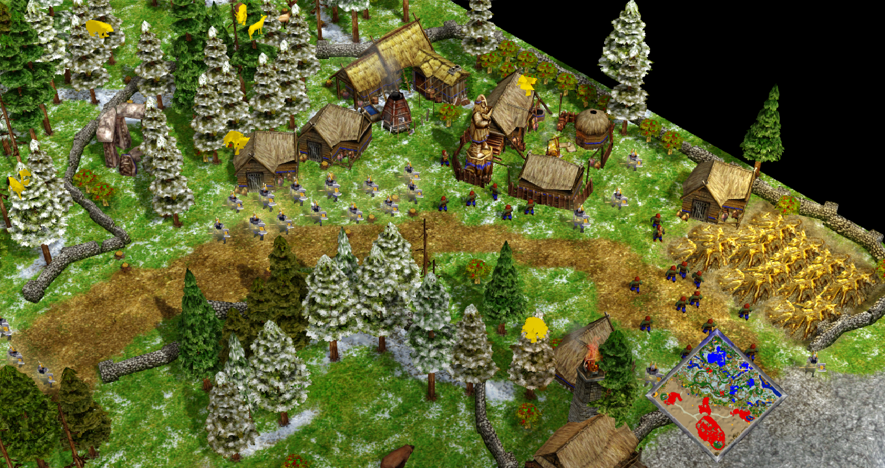

* **Central Desert**: homeland of the Bedouins, the Central desert is a harsh land with few trees and dry weather.  But the land is rich in minerals, and some oases with palm trees and fish can be found. The Bedouin's capital is the have the stronger fortifications on the whole continent. 
> 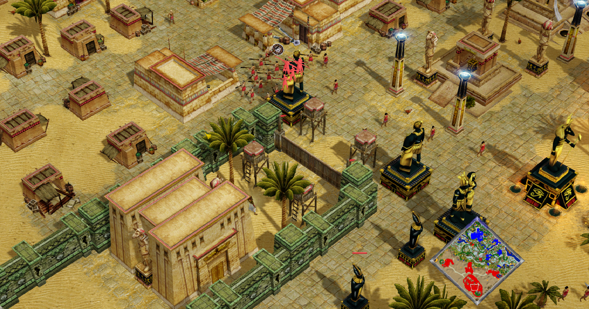

* **South Savannah**: homeland of the Werejackals, is a vast savannah with plenty of natural resources. Their capital is a farm city close to the sea. The wildlife is composed of savannah animals like Giraffes, Gazelles, and Lions, but also Nemea Lions. 
> 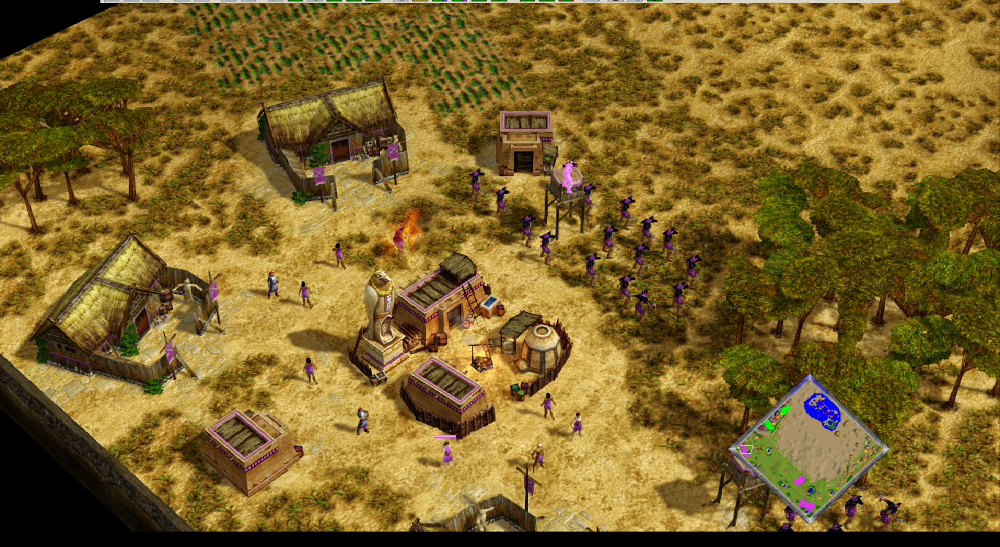

* **Rock Valey**: The most mysterious and secluded land of the continent. It is a misty land surrounded by the western sea and the fire mountains at the east. Dense fogs fill its pine-dark forest, and the wildlife is mostly composed of mysterious mythical creatures. Its wildlife includes giant scrabs, flying serpents,  walking trees, manticores, chimeras, and dragons.  This is the homeland of the Trolls. Each clan leader of each settlement wons a pet, a faithful beast from the wilds.
> 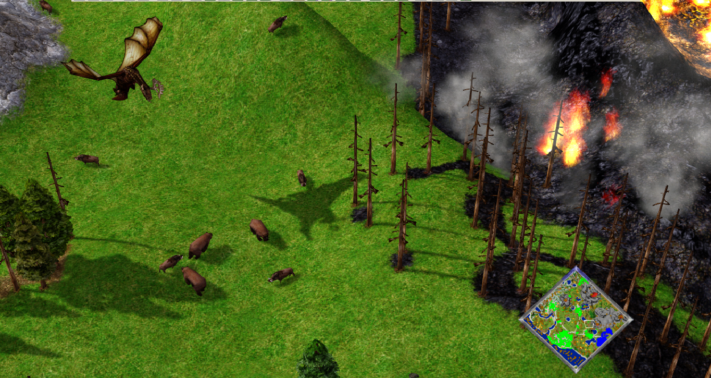
> 

* **Oak Forest**: An oak forest surrounded in the west by the Rock Mountains. It is inhabited by the Cyclops, the stronger race of the continent. They have only one main city close to the sea and the Savannah. The wildlife is composed mainly by deer and boars.
> 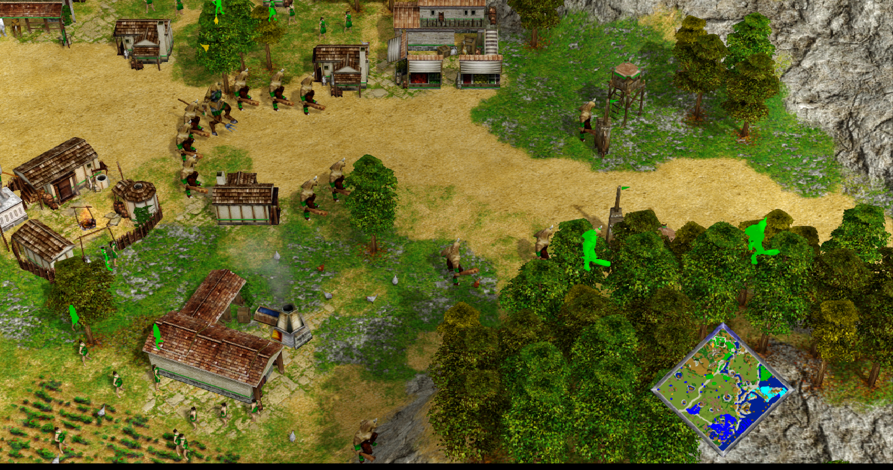

* **Palm Isthmus**: A small portion of land in the south, inhabited by the Cretans. They are fewer in number but have the stronger navy army on the continent. In the forest, dryads can be found, and in the sea Krakens, Leviathans, Carcinos, and Wales can be seen. 
> 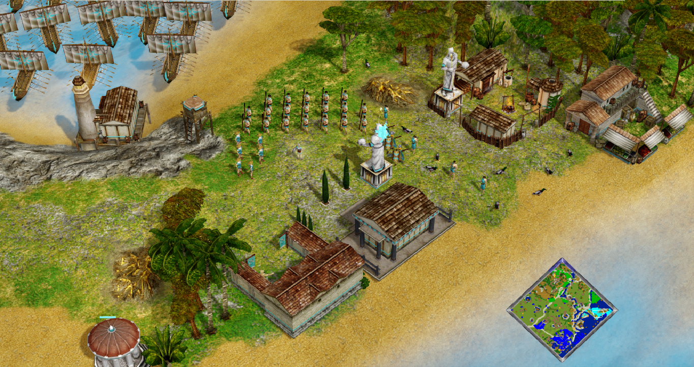

## Random Maps

This mod includes some new random maps as well, not related to the campaign, but each one with a unique mechanic:

* **Arabian Desert**: A large desert with hidden treasures and bandit camps and scarce wood.
> 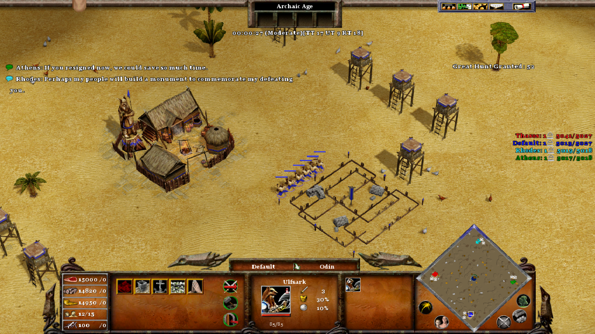

* **Elysius Camps**: A miraculous and brilliant land, with plenty of resources available, but you will have to fight for it.
> 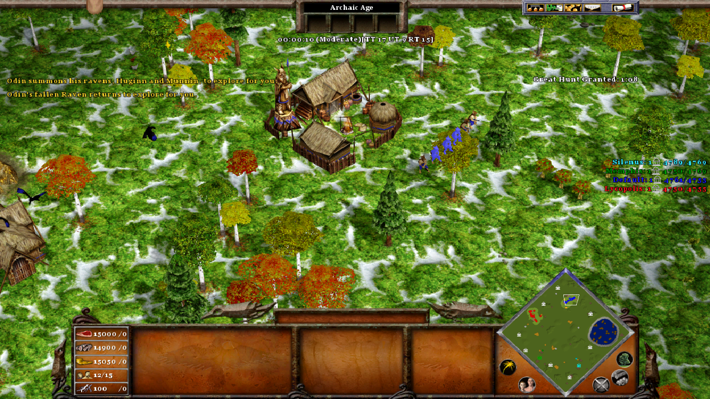

* **Guardians' Valley**: Each player starts with a Guardian in the Valley of the Kings.
> 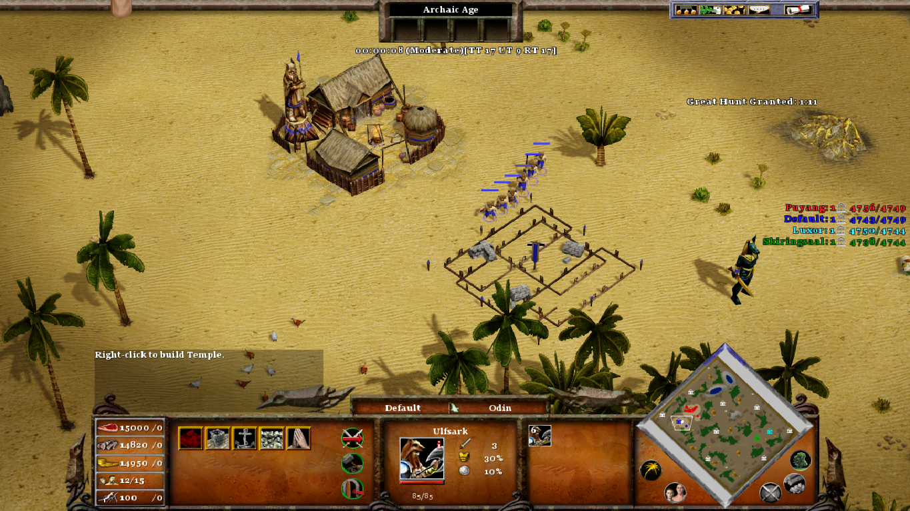

* **Guardians' Megalopolis**: Each player starts with a Guardian in a Savanna megalopolis.
> 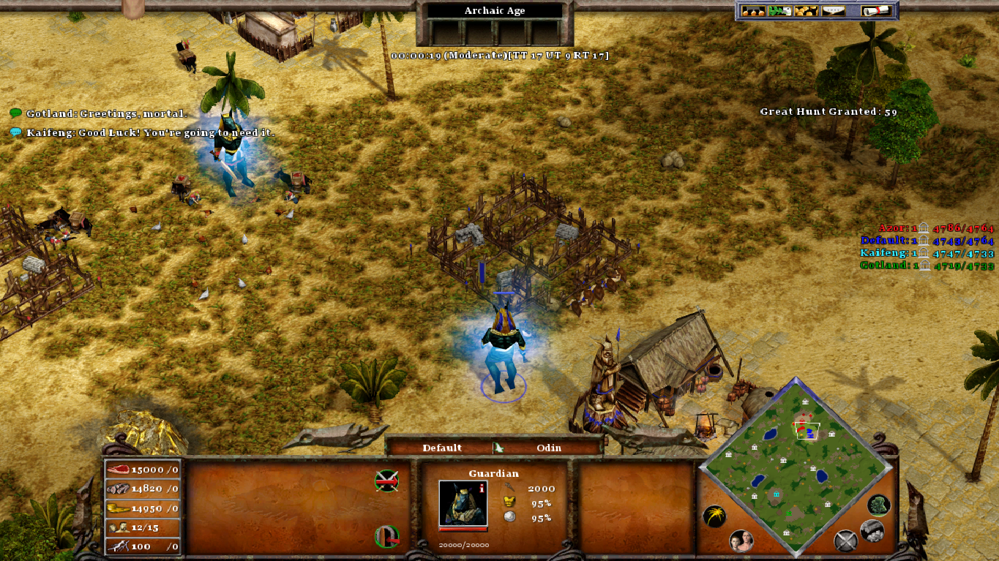

* **One Settlement**: All players start with one settlement and some small villages. But there are no other settlements available.
> 

* **Ragnarock**: A Battle Royale among the gods in a nordic apocalyptic World.
> 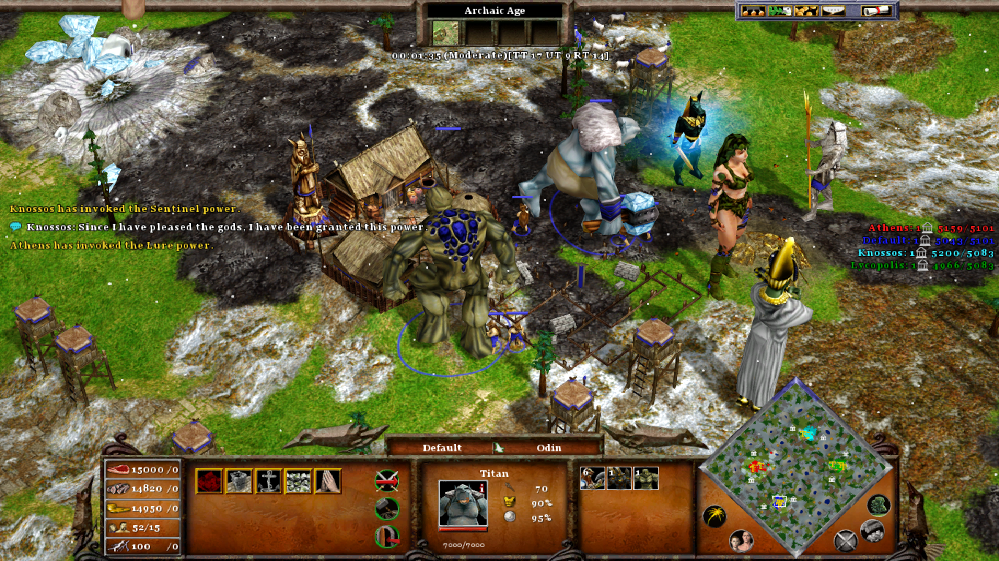

* **Sahara Desert**: All resources are hard to be found on this map, especially wood.
> 

* **Starting Army**: Each player starts with a huge army.
> 

